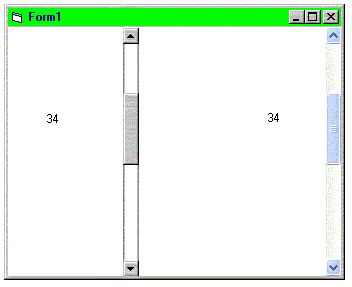



## Windows XP Vertical Scroll Bar

### Description

Windows XP Verticle Scroll Bar. Nearly identical to real thing. Will subclass next, and then make horizontal bar.
 
### More Info
 

             |
---                |---
**Submitted On**   |2002-02-13 16:24:04
**By**             |[David Huschka](https://github.com/Planet-Source-Code/PSCIndex/blob/master/ByAuthor/david-huschka.md)
**Level**          |Intermediate
**User Rating**    |5.0 (20 globes from 4 users)
**Compatibility**  |VB 6\.0
**Category**       |[Custom Controls/ Forms/  Menus](https://github.com/Planet-Source-Code/PSCIndex/blob/master/ByCategory/custom-controls-forms-menus__1-4.md)
**World**          |[Visual Basic](https://github.com/Planet-Source-Code/PSCIndex/blob/master/ByWorld/visual-basic.md)
**Archive File**   |[Windows\_XP551392132002\.zip](https://github.com/Planet-Source-Code/david-huschka-windows-xp-vertical-scroll-bar__1-31774/archive/master.zip)

